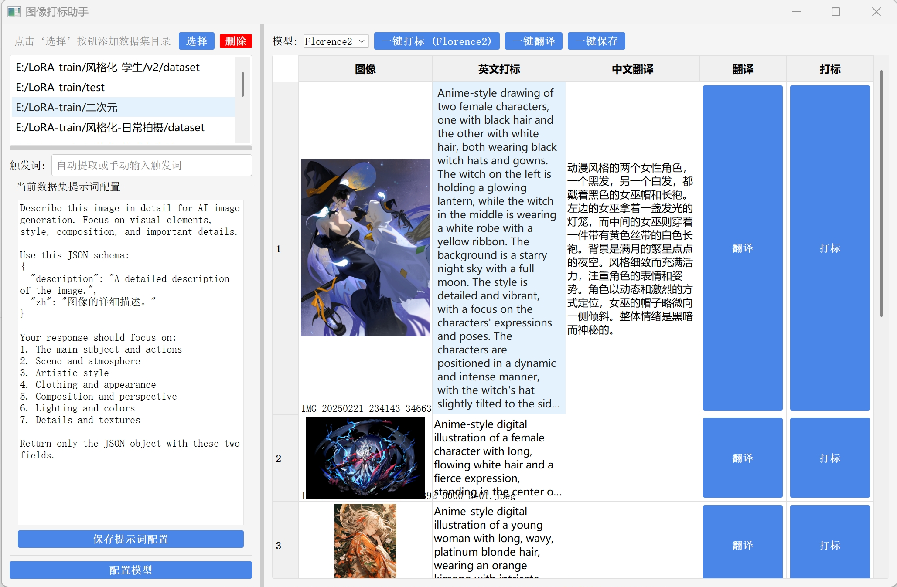

# 图像打标助手

一个用于图像打标的工具，专为训练Lora模型设计。该工具可以使用Google Gemini API、智谱多模态API或本地Huggingface模型自动为图像生成英文标签，并提供中文翻译，方便用户理解和修改。



## API注册

在使用在线API服务前，您需要先注册相应平台并获取API密钥：

### 1. Google Gemini API
- 注册地址: [https://aistudio.google.com/](https://aistudio.google.com/)
- 说明: 需要Google账号，注册后创建API密钥
- 免费额度: 提供一定的免费调用额度

### 2. 智谱AI API
- 注册地址: [智谱GLM](https://www.bigmodel.cn/invite?icode=F7Kxw9I8kptfUQ%2FJjpH8s3HEaazDlIZGj9HxftzTbt4%3D)  
- 说明: 需要手机号注册，完成实名认证
- 免费额度: GLM-4-Flash-250414、GLM-4V-Flash提供免费调用额度

## 功能特点

- 手动管理图像目录，添加和删除目录
- 浏览图像，显示缩略图和文件名
- 支持多种打标模型：
  - Google Gemini AI（在线API）
  - 智谱GLM多模态模型（在线API）
  - 多种Huggingface Florence模型（本地运行）
- 自动翻译：使用Bing翻译服务（免费）
- 一键标注整个目录的图像
- 一键保存标注结果到文本文件
- 多行文本编辑支持，便于处理长描述
- 自动检测未保存内容，避免意外丢失
- 全屏显示界面，提供更好的工作体验

## 安装方法

1. 确保已安装Python 3.12
2. 克隆或下载本仓库
3. 安装uv工具（如果尚未安装）：

```bash
# 在Windows上
curl -sSf https://astral.sh/uv/install.ps1 | powershell
# 在Linux/macOS上
curl -sSf https://astral.sh/uv/install.sh | sh
```

4. 使用uv初始化和安装依赖：

```bash
# 创建并初始化虚拟环境
uv venv --python=3.12
# 激活虚拟环境（Windows）
.\.venv\Scripts\activate
# 激活虚拟环境（Linux/macOS）
source .venv/bin/activate
# 安装CUDA版本的PyTorch（推荐，支持GPU加速）
uv pip install torch torchvision --extra-index-url https://download.pytorch.org/whl/cu126
# 安装其他依赖项
uv pip install .
```

如果不需要GPU加速，可以直接使用：

```bash
uv pip install .
```

## 可用的图像打标模型

本工具支持以下模型进行图像打标：

1. **Gemini API（在线）**：
   - 需要Google AI Studio API密钥
   - 提供高质量的图像描述
   - 支持定制化提示词配置

2. **智谱GLM多模态模型（在线）**：
   - 支持GLM-4V-Flash（免费）和GLM-4V-Plus-0111多模态模型
   - 需要智谱AI API密钥
   - 中文理解能力强，适合中文用户
   - 返回JSON格式结果，包含中英文描述
   - 配置方法：
     - 在"配置API"对话框中选择"智谱AI配置"选项卡
     - 输入API密钥（获取地址：https://www.bigmodel.cn/）
     - 选择模型版本（GLM-4V-Flash或GLM-4V-Plus-0111）
     - 调整温度和最大输出长度参数

3. **Florence系列模型（本地）**：
   - 无需API密钥，完全本地运行
   - 首次使用时会自动下载模型（约2GB）
   - 支持的模型包括：
     - MiaoshouAI/Florence-2-large-PromptGen-v2.0
     - MiaoshouAI/Florence-2-base-PromptGen-v2.0
     - microsoft/Florence-2-large-ft
     - microsoft/Florence-2-base-ft
     - microsoft/Florence-2-large
     - microsoft/Florence-2-base

### 切换模型

1. 在界面顶部的"模型"下拉菜单中选择所需模型
2. 选择后，"一键打标"按钮的文本会自动更新为当前所选模型
3. Florence模型首次使用时需要下载，请耐心等待
4. 如有GPU，Florence模型将自动使用GPU加速

## 配置 API

本程序支持配置三种API服务：

### 1. Gemini API（图像打标）

为了使用Gemini API进行图像标注，需要配置Google Gemini API：

1. 首次运行程序时会提示配置API
2. 获取Gemini API密钥：https://aistudio.google.com/
3. 在配置对话框中输入API密钥和选择模型
4. 可以调整温度和最大输出token等参数，适应不同需求

#### Prompt 配置说明

本程序默认配置了一个针对图像生成优化的prompt，它会指导Gemini API返回JSON格式的结果，包含以下字段：

```json
{
  "description": "A detailed description of the image.",
  "zh": "图像的详细描述。"
}
```

这个JSON格式包含两个关键字段：
- **description**: 英文详细描述，作为主要的图像标签
- **zh**: 中文翻译，帮助中文用户理解

### 2. 智谱多模态API（图像打标）

1. 在"配置API"对话框的"智谱AI配置"选项卡中配置
2. 获取GLM API密钥：https://www.bigmodel.cn/
3. 输入API密钥，选择模型版本（GLM-4V-Flash或GLM-4V-Plus-0111）
4. 调整温度和最大输出长度参数
5. 该模型直接返回中英文描述，无需额外翻译

### 3. 翻译服务

本程序使用 Bing 翻译服务进行自动翻译：

1. 无需配置，直接使用
2. 免费，无需 API 密钥
3. 支持多种语言之间的翻译
4. 翻译质量稳定可靠

## 使用方法

运行主程序：

```bash
python main.py
```

### 基本使用流程

1. 点击"选择"按钮通过文件对话框选择图像目录，目录会自动添加到列表
2. 在左侧列表中点击目录，右侧表格会显示该目录中的所有图像
3. 在顶部下拉菜单中选择要使用的模型（Gemini、智谱多模态或Florence系列模型）
4. 点击单个图像旁的"打标"按钮生成标签，或使用顶部的"一键打标"批量处理
5. 可以输入"触发词"作为前缀添加到每个标签的开始
6. 手动编辑英文标签（支持多行编辑）
7. 点击"翻译"按钮获取中文翻译（使用 Bing 翻译服务）
8. 使用"一键保存"将所有标签保存为文本文件
9. 如需删除目录，选中左侧列表中的目录后点击"删除选中目录"按钮

### 内容修改提示

- 当表格内容被修改（无论手动修改、打标或翻译）后，切换目录时会提示保存
- 点击"一键保存"会将所有标签保存到文本文件，并清除修改标记

## 标签保存格式

标签将保存为与原图像同名的`.txt`文件，保存内容为标签的英文描述。

## 技术特性

- 使用PyQt6构建图形界面
- 多线程处理图像标注和翻译，避免界面冻结
- 支持在线API和本地模型的混合使用
- 使用Google Gemini API进行在线图像标注
- 使用智谱GLM多模态API进行在线图像标注
- 使用Huggingface的Florence系列模型进行本地图像标注
- 使用 Bing 翻译服务进行自动翻译（免费）
- 本地模型自动缓存，避免重复下载
- 数据缓存和配置保存

## 许可证

MIT
